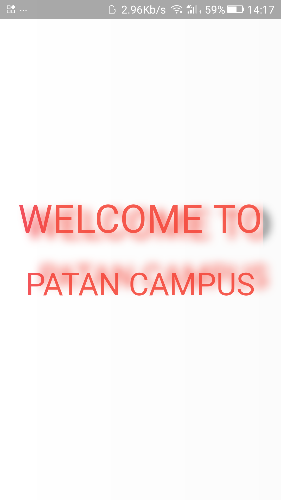
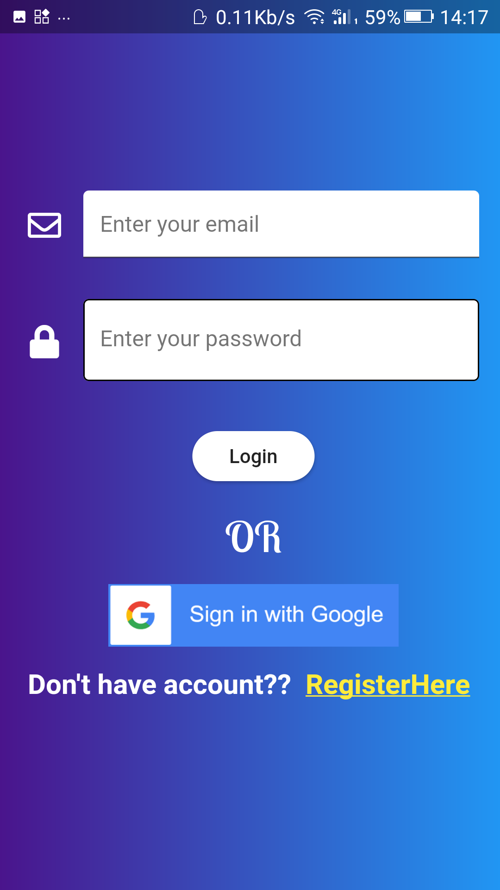
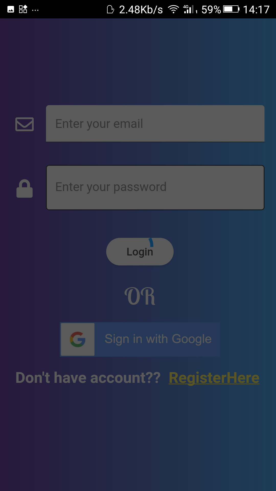
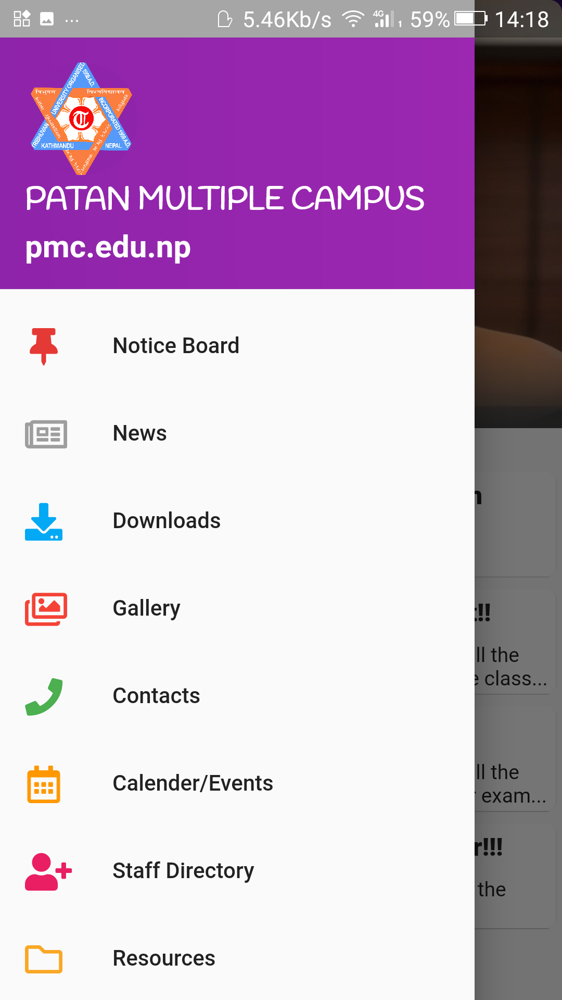

# PatanCollegeApplication
> This application was my first mobile application made using flutter sdk and making this project was a great experince for me as it took me quite a long time and daily I added some features to make it interactive and attractive.

# Snapshots Of Application

# Techologies used

* Flutter

* Dart

* Firebase

* Vscode

